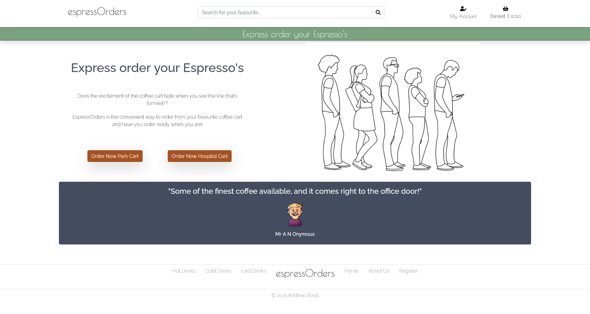
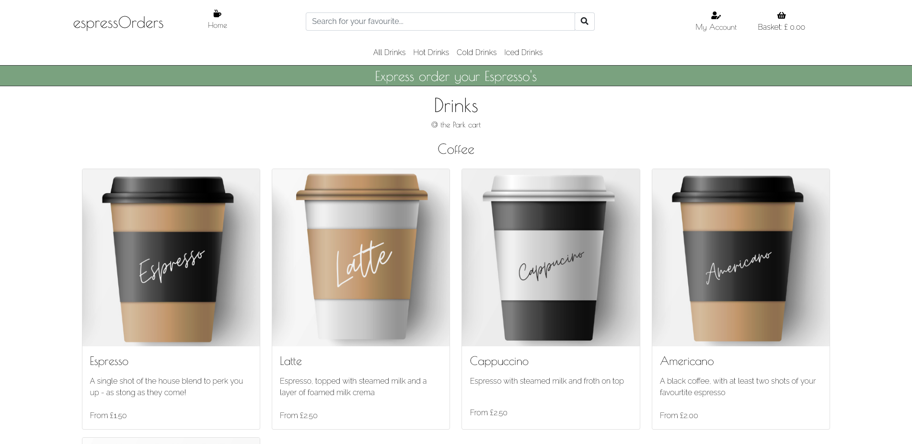
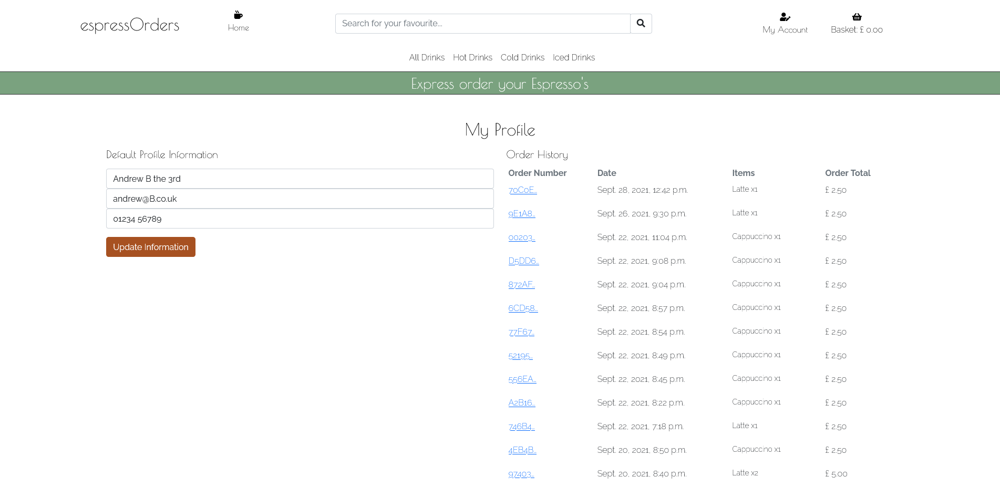
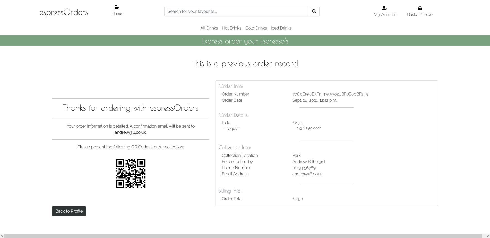

# **espressOrders** 


[View espressOrders website ](https://ab79-espressorders-dev.herokuapp.com/)


This espressOrders website has been produced by Andrew Boyd as a Milestone Project 4 for the Code Institute’s Full Stack Web Development course.

They seem to be everywhere you look these days - coffee carts!
From little trucks to converted horse boxes they are popping up everywhere - from beauty spot carparks, to the beach and even at kids football matches. The "post-covid" work office seems also to have created a coffee cart culture and it is this that I hope the espressOrders application will tap into.

The purpose of espressOrders is to allow ordering from your favourite coffee cart ahead of time - to beat that inevitable queue! 

The website aims to allow users to select a coffee cart and browse drinks are available from that cart; allow users to make their selection and customise their order and then pay for it within espressOrders site. The user will get confirmation of their order with a qr code, which will speed up collection and order processing and they have the ability to save their details for future visits.

---

## **Contents**
1. **[UX](#ux)**
    - [Business Goals](#Business-Goals)
    - [Target Audience](#Target-Audience)
    - [User Goals](#User-Goals)
    - [User Stories](#User-Stories)
    - [Wireframe diagrams](#Wireframe-diagrams)
        - [Home Page](#Home-page)
        - [Product Page](#Product-page)
        - [Description Page](#Description-page)
        - [Login Page](#Login-page)
        - [Registration Page](#Registration-page)
        - [Order Summary Page](#Order-summary-page)
        - [Profile Page](#Profile-page)


    - [Design Considerations](#Design-considerations)
        - [Colours](#Colours)
        - [Fonts](#Fonts)
        - [Icons](#Icons)
        - [Styling](#Styling)

2. **[Features](#Features)**
    - [Initial Release Features](#Initial-release-features)
        - [Global Features](#Global-features)
        - [Home Page Features](#Home-page-features)
        - [Product/Product Detail Pages Features](#Product/Product-detail-pages-features)
        - [Basket Page Features](#Basket-page-features)
        - [Checkout/Checkout Success Page Features](#Checkout/checkout-success-page-features)
        - [Profile/Order History Page Features](#Profile/Order-history-page-features)
        - [Other Features](#Other-features)

    - [Features for future releases](#Features-for-future-releases)

3. **[Information Architecture](#Information-architecture)**
    - [Database Choice](#Database-choice)
    - [Entity Relationship Diagram](#Entity-relationship-diagram)

4. **[Technologies Used](#Technologies-used)**
    - [Languages](#Languages)
    - [Libraries](#Libraries)

5. **[Testing](#Testing)**

6. **[Deployment](#Deployment)**

7. **[Credits](#Credits)**
    - [Images](#Images)
    - [Code](#Code)
    - [Acknowledgements](#Acknowledgements)
---

# **UX**
User Experience, and associated UX design, is concerned with how a user interacts with something; throughout this project, consideration has been given to each of the five planes of UX.

## Business Goals
The business expects this website to:
- Provide information regarding the service and give users information on their carts
- Display the products available in each of the cart locations - over time each carts menu will evolve and so will differ from the others
- Allow for addition, editing and deleting of products from the cart menu - only admin/superuser accounts should have this ability
- Have necessary security functionality to ensure users cannot access admin functions
- Record all the details necessary to process a customers order - this will include recording order, user and billing information
- Take payment for a customers order
- Promote their business/brand as a convenient and easy to use

## Target audience
The target audience of this website is:
- Individuals who frequently user coffee carts
- Individuals who have limited time available over their break/lunchtime
- Office groups/departments who make larger orders on a daily basis and want a more convenient method of ordering
    
Users will be expecting information presentation to be:
- Accurate – information needs to be not only factually correct but up to date
- Clear – well presented in a logical fashion
- Engaging – the website should encourage users to want to use it and come back to it
- Intuitive - it should be quick and easy to use

## User Goals
Users of this website expect to be able to:
- Select and order coffee from their chosen coffee cart
- Customise and pay for their order securely
- Find out relevant information about the coffe cart 


## User Stories
The following user stories have been developed to outline some of the benefits the website has to its users:

1. As a customer I expect to be able to find information about where the coffee carts are located
2. As a customer I expect to be able to find out the opening hours of the carts
3. As a customer I expect to be able to see what product is available at each cart location
4. As a customer I expect to be able to search for items directly
5. As a customer I expect to be able to filter/sort products by their type
6. As a customer I expect to be able to find information about each item
7. As a customer I expect to be able to customise my order
8. As a customer I expect to be able to clearly see the costs of the items and total order before payment
9. As a customer I expect to be able to pay for my order through the website
10. As a customer I expect to be able to save my details to speed up my purchasing experience; I also expect to be able to check out with saving my details
11. As a customer I expect to be able to update my details if they have changed since last purchase
12. As a customer I expect to be able to review my past orders
13. As a customer I expect to be able to keep my personal information secure

14. As a business owner I expect to be able to add, edit and remove items from the product range
15. As a business owner I expect to be able to record/store/access all information necessary to take payments for customer orders 
16. As a business owner I expect to be able to have a means to quickly differentiate between customer orders to ensure each customer gets their order correctly
17. As a business owner I expect to be able to be sure that an order is recorded if a user has successfully paid for it (redundancy built in to system)
18. As a business owner I expect to be able to secure the site so only authorised user can access/edit products
19. As a business owner I expect to be able to allow users to access relevant socail media channels


## Wireframe diagrams

### Home Page 

 - [Mobile view](documentation/wireframes/Wireframing_home_mobile.pdf)
 - [Tablet view](documentation/wireframes/Wireframing_home_tablet.pdf)
 - [Desktop view](documentation/wireframes/Wireframing_home_desktop.pdf) 

### Product Page

 - [Mobile view](documentation/wireframes/Wireframing_products_mobile.pdf)
 - [Tablet view](documentation/wireframes/Wireframing_products_tablet.pdf)
 - [Desktop view](documentation/wireframes/Wireframing_products_desktop.pdf)

### Description Page

 - [Mobile view](documentation/wireframes/Wireframing_product_details_mobile.pdf)
 - [Tablet view](documentation/wireframes/Wireframing_product_details_tablet.pdf)
 - [Desktop view](documentation/wireframes/Wireframing_product_detail_desktop.pdf)

### Login Page

 - [Mobile view](documentation/wireframes/Wireframing_login_mobile.pdf)
 - [Tablet view](documentation/wireframes/Wireframing_login_tablet.pdf)
 - [Desktop view](documentation/wireframes/Wireframing_login_desktop.pdf)

### Registration Page

 - [Mobile view](documentation/wireframes/Wireframing_registration_mobile.pdf)
 - [Tablet view](documentation/wireframes/Wireframing_registration_tablet.pdf)
 - [Desktop view](documentation/wireframes/Wireframing_registration_desktop.pdf)

### Order Summary Page

 - [Mobile view](documentation/wireframes/Wireframing_order_summary_mobile.pdf)
 - [Tablet view](documentation/wireframes/Wireframing_order_summary_tablet.pdf)
 - [Desktop view](documentation/wireframes/Wireframing_order_summary_desktop.pdf)

### Profile Page

 - [Mobile view](documentation/wireframes/Wireframing_profile_mobile.pdf)
 - [Tablet view](documentation/wireframes/Wireframing_profile_tablet.pdf)
 - [Desktop view](documentation/wireframes/Wireframing_profile_desktop.pdf) 


## Design Considerations

### Colours

These have been selected to give a clean minimal look to the website.  
 - White - #ffffff
 - Dark Grey - #151515
 - Mid Grey - #2f3434
 - Rust - #A75121
 - Light Green - #7AA27F

The combination has been checked on Adobe Colour; no potential conflicts have been found and the swatches are colour blind safe.

### Fonts

- Poiret One - this has been chosen as the brand font for the espressOrders site. It is distinctive enough to stand out but remains readable at all sizes. Poiret One is available only at a weight of 200. It is available from Google fonts nad it it fails it will be replaced with a cursive font within the browser.

- Raleway - this sans-serif font has been chosen to compliment Poret One, with both fonts sharing similar distinctive characters which makes them sit well together. It is being used at weights 200 & 400 across the site. It is available on Google fonts and if it fails it will be replaced with a sans serif font within the browser.

### Icons
The following Font Awesome icons from will be used throughout this website:

- [Mug Hot]( https://fontawesome.com/v5.15/icons/mug-hot?style=solid )
- [Search]( https://fontawesome.com/v5.15/icons/search?style=solid )
- [User Edit]( https://fontawesome.com/v5.15/icons/user-edit?style=solid )
- [User Edit]( https://fontawesome.com/v5.15/icons/user-edit?style=solid )
- [Wrench]( https://fontawesome.com/v5.15/icons/wrench?style=solid )
- [ID Card]( https://fontawesome.com/v5.15/icons/id-card?style=solid )
- [Sign Out]( https://fontawesome.com/v5.15/icons/sign-out-alt?style=solid )
- [User]( https://fontawesome.com/v5.15/icons/user-plus?style=solid )
- [Sign In]( https://fontawesome.com/v5.15/icons/sign-in-alt?style=solid )
- [Shopping Basket](https://fontawesome.com/v5.15/icons/shopping-basket?style=solid )
- [Facebook](https://fontawesome.com/v5.15/icons/facebook?style=brands )
- [Twitter](https://fontawesome.com/v5.15/icons/twitter?style=brands )
- [Instagram](https://fontawesome.com/v5.15/icons/instagram?style=brands )
- [Plus Circle](https://fontawesome.com/v5.15/icons/plus-circle?style=solid )
- [Minus Circle](https://fontawesome.com/v5.15/icons/minus-circle?style=solid )
- [Times Circle](https://fontawesome.com/v5.15/icons/times-circle?style=regular )
- [Exclamation Circle](https://fontawesome.com/v5.15/icons/exclamation-circle?style=solid )

### Styling
The website was styled to give a minimalistic feel.

---

# **Features**
The website will initially be developed as a Minimal Viable Product (MVP) and developed from there with new features being added as time/developer skills allow.

## Initial release features
Based on importance/feasability analysis the following features will be available in the initial release:

- The user will be able to select which cart they are wishing to order from. This will give the site owner the opportunity to be set a list of products which are specific to a cart.
- Useful user information is available on each cart location.
- The user will have the ability to filter the drinks according to type (Hot Drinks/Cold Drinks/Iced Drinks) and by category within these types (Coffee/Rea/Speciality Coffee within the Hot Drinks type). Defining a product by type and category allows for easily managed expansion/diversification of the product line within significant refactoring of the codebase. Selecting an options (type or category) filters the products displayed accordingly.
- The user will have the ability to search within the name / description fields.
- The user will be initially be able to specify the product they wish to order, its size and the quantity. Where products are only available in single size this will be detailed within the product description.
- The users current order will be stored in a bag which is stored in session cookies. This allows the user to continue where they left off with their order if they need to leave/return. Items can be removed from the bag and the bag is cleared once an order has been successfully placed.
- Users can pay for their items using a secure Stripe payment form.
- Users specify at the checkout which cart they want to collect their order from.
- Users can save their default profile information to save them having to complete them if returning. Users can register for a profile to allow them to do this.
- Users can be assured that their order will be recorded if payment is successfuly as the site can record orders through the payment intent/webhook handler if the user form isn't submitted successfully.
- Users can view and update their default profile information.
- Users can also view details on all previous orders (summary and full details).
- Order information a QR Code which the user can use to speed up order collection process.
- Site administrators have the ability to add/edit and delete items from the product line

## Global Features
The following features will persist across all website pages to provide a consitent look and feel:

 ### Header section

- Branding - the espressOrders name will be located in the top left portion of the header; it will provide consistent branding.  Clicking on the logo returns the user to the home page. The branding alter location to the centre on smaller screen sizes as the options collapse under a hamburger menu icon.

- Navbar - the nav bar is comprised of home elements to the left side of the screen, search box in centre and account/basket info on the right side of screen on desktop. Home button is displayed on all pages apart from the home page itself (where it is not necessary). There is a dropdown menu under the My Account icon housing the Product Management/User Profile and Login/out functionality.


- The navbar/secondary navbar will size responsively and the icons/menus will drop under a hamburger icon located on left hand side of screen; the basket remains visible on all screen sizes on the right hand side of the display. 

- Secondary navbar - on all pages (apart from the home page) a secondary navbar exists with the product types/categories (see below). Each houses a dropdown to allow the user to choose a product type/category as appropriate. This also drops under the hamburger icon on smaller screen sizes.


- Subhead banner - a subheading banner, in contrasting colour, is displayed on all screen sizes. This allows the site administrator to provide promotion/information to site users in a prominent location. 


### Footer Section


- Sitting above the main footer section, in contrasting colours, are the social media icons which take users to site related Facebook, Twitter or Instagram accounts. This is displayed on all screen sizes.

- The main footer section is broken down into three distinct elements.

- A types filter (Hot Drinks/Cold Drinks/Iced Drinks) is present on left hand side of branding. Unlike the header there is no dropdown option displaying categories. This element persists on smaller screen sizes.

- A further branding element exists on larger screen sizes only - clicking the element returns the user to the homepage.

- Useful information (Home/About Us/Profile) is present to the right hand side of the branding on larger screens and alongside the types filter on smaller screen sizes. 

- The footer elements will resize responsively.


## Home Page Features



 - When users arrive at the home page they are greeted with the main hero section which contains imagery and a brief explanation of who espressOrders are & what they do.

 - Users can then select a location from one of the 2x call to action/order now buttons which will load the relevant product page.

 - Under the hero section is a 'social proof' or blog post section which could house reviews, blog posts etc.

## Product/Product Detail Pages Features

- The product & product detail pages contain the majority of the sites information. The information is presented in an sinmple responsive grid layout; it aims to be engaging, visually appealing and informative about the products, prices customisation options etc. The number of products displayed on the grid varies from 4x across on largest screen sizes to 1x across on mobile to make best use of space.



- The graphics/images for each product are simple, consistent in size and style and hopefully visually engaging. If no image is available for a product a default cup image with 'Coming soon' is displayed - the aim is to maintain consistent imagery at all times.

- The user gets some basic information about the item on the product page and further details/options when they click the image to open the product detail page. The product detail layout is responsive to make best use of screen size.


- Dropdown menu allows user to select size option - if only one size option is available this menu is not displayed and the size available is shown. The quantity is chosen from a number input box with custom buttons to increase/decrease the quantity.

- The user can choose to add the product selection to their order or return to the products page.

- When an item is ordered/added to the user basket a toast/message is displayed indicating what product has been added to the user basket and allowing the user to go directly to the secure checkout. This message must be dismissed by the user.

## Basket Page Features

- The basket page shows the items the user has currently ordered. When the basket is empty the user is alerted to that fact and prompted to return to the products page. The basket is displayed full width of the screen on all device sizes.

 

- The basket summarises the items in the order detailing the quanity of each product, any customisation/size options and the cost of that line item. A total cost for the order is also calculated.

- A button allows the user to remove items directly from their order.

- Another button allows the user to access the secure checkout.

## Checkout/Checkout Success Page Features

- The checkout page is split into two columns on larger screens and single full width column on smaller device sizes.

- There is an order summary section (similar in layout/style to the basket page is displayed) showing the number/information regarding the items to be ordered. Users can return to the basket directly from this section to amend their order.

- The user then completes a form containing their Personal Details, Collection Details and Payment Details. This form is styled to be consistent with the rest of the site.


- The user can opt to save/update 'default' personal details if they're logged in to their profile. If they've opted to save details their personal information will be completed when they open the checkout page. They can also redirect to register or login to an account directly from this page.

- There is a warning indicating that completion of all sections of the form will result in their card will be charged the amount listed in the order summary.

- A toast/mesaage indicates if the order has been completed successfully.

- The checkout success page contains summary information related to the Order Info, Order Details, Collection Info and Billing Information.


- The page also includes a QR code, of the order number, which can be presented for speedier collection.

- The user also gets an automatic email confirmation of their order which contains the same information and QR code.

## Profile/Order History Page Features

- The profile page option is available on the My Account dropdown for users who are resistered and logged in to the site.



- It has two sections - Default Profile Information & Order History. The Default Profile History lists the current user information and allows the user to update it directly from the profile page. The order history lists an overview of each order the user has placed in date order - with newest orders being displayed first.



- Clicking on an order number takes the user to the order summary page for that order number - the user is alerted that they are reviewing a previous order. All information from the order success page is displayed including the QR Code.

-  A button allow the user to return directly to their profile page. All back/return buttons are styled consistently but are visually distinct from the other button types.

## Other Features
- Site administrators have the ability to add products from a Product Management option on their My Account dropdown. They can edit/delete products directly from within the products and product details pages.


- Toasts/messages appear throughout the site following a variety of user actions.


- Registration, login, account management and authentication is handled within Django using AllAuth 

## Features for future releases
The following features will be added to the website in future releases:

- Further customisation options specific to each drink type/category will be available in future releases.

- Additional user payment options will be incorporated into the site to give the user further choice on how they wish to pay for their order.

- Email confirmation of user order with all order information/QR Code being included.

- Information on each cart will integrate Google Maps to show the cart on map and provide user directions from current location.

- The home page will feature more content for information/blog posts to allow site administrator to engage more fully with users. This section may then link to form/means to allow users to leave a review/comment.

- Additional seasonal categories e.g. special offers, winter warmers etc. will be added to allow the site administrator to highlight specials and new product lines.

- Allow users to save default payment detailed to speed up the checkout process.

- Social account integration with AllAuth for registration/account management.

---

# **Information Architecture**

## Database Choice
The postgressql database has been chosen to host the data from espressOrders in the production environment. The following factors influenced this decision:

- Ease of use and development
- High performance
- High availablity
- Scalability

An Amazon AWS S3 bucket (configured with the necessary policies and user access) has been chosen to host the static/media files for the website in the production environment. 

In the development environment a sqlite3 database is used and static/media files are stored locally. Config variables within the Heroku app are used to determine if website is in the development/production environment and whether AWS should be used.

## Entity Relationship Diagram
The following Entity Relationship diagram has been produced to show the relationships between the entity sets in the espressOrders database

[Entity Relationship Diagram](documentation/screenshots/espressOrders_ERD.pdf)

---

# **Technologies Used**

## Languages
- HTML5 was used to structure and present the content of this website
- CSS3 was used to style the presentation of the website
- JavaScript was used to control the interactive elements of the website
- Python (3.8.11) was used to develop the backend of the website

## Frameworks/Libraries/Programs
- [BootStrap (5.1.1)](https://getbootstrap.com/) was used to aid with responsive design and increation of some of the project elements
- [jQuery (3.5)](https://api.jquery.com/) was used to aid in the writing of the JavaScript elements
- [Google Fonts](https://fonts.google.com/) was used to provide the fonts
- [Font Awesome](https://fontawesome.com/) was used to provide the icons for the project 
- [GitHub](https://github.com/andrewboyd79/EspressOrders) was used to hold the espressOrders repository 
- [GitPod](https://gitpod.io/workspaces/) was used as the dev environment for the project
- [Stripe](https://stripe.com/en-gb) was used to take payments
- [Figma](https://www.figma.com/) was used to create the wireframes and other diagram elements
- [Canva](https://www.cana.com) was used to create the product images
- A full list of Python packages (and versions) is detailed within the [requirements.txt](requirements.txt) file

---

# **Testing**

A separate [testing.md](/documentation/testing.md) file has been created to record the testing.

---

# **Deployment**

## Cloning the GitHub repository

It may be necessary to clone the repository from GitHub to your local computer.  Cloning the repository makes a copy of all the of repository data and takes it from GitHub to your local machine.  The following steps, detailed below, should be taken to clone a repository:

1. Navigate to the main page of the repository (in this case https://github.com/andrewboyd79/espressorders)

2. Select the green button labelled Code

3. To clone the repo using HTTPS select the "HTTPS" option; to clone using an SSH key select the second opttion "SSH"; to clone using GitHub CLI select the third "GitHub CLI" option. Use the clipboard icon to copy the relevant information.

4. Open Git Bash and change the working directory to the location where you wish the cloned repo to be stored.

5. Use the git clone command and paste in the information copied in step 3 and Press Enter to create a local clone

6. If you wish to clone the repo to GitHub Desktop repeat steps 1 & 2 and from there select the "Open with GitHub Desktop" option

7. Follow the on screen prompts from within GitHub Desktop (this option required GitHub Desktop to be installed to be successful!)

Support information, for this process, can be found on the [GitHub Pages section](https://docs.github.com/en/free-pro-team@latest/github/working-with-github-pages/configuring-a-publishing-source-for-your-github-pages-site) of the GitHub Docs 

---

## Deployment to Heroku

To deploy the espressOrders webiste to Heroku the following steps were taken:

1. Create a Procfile by using the command ````echo web: python app.py > Procfile```` at the terminal prompts. Any extra lines need to be removed from the end of the Procfile
2. Create a requirements.txt file using the command ````pip3 freeze —local > requirements.txt````
3. Log in to the Heroku account
4. Click the create new app button. Provide a name for the app (must be unique within Heroku) and choose the closest region to your location (namely Europe)
5. Set up deployment from GitHub repository ( Deploy > Deployment method > GitHub) - at this stage automatic deployment from GitHub repository should not be selected
6. Choose the appropriate GitHub repository (campfireCooking) from the options
7. Select the Reveal Config Vars option and set the config vars as follows:

| Key                           | Value                           |
|-------------------------------|---------------------------------|
| AWS_ACCESS_KEY_ID             | < AWS Access Key Value >        |
| AWS_SECRET_ACCESS_KEY         | < AWS Secret Access Key Value > |
| DATABASE_URL                  | < postgressql db url >          |
| EMAIL_HOST_PASS               | < email host password >         |
| EMAIL_HOST_USER               | < email address >               |
| SECRET_KEY                    | < secret key value >            |
| STRIPE_PUBLIC_KEY             | < Stripe Public key value >     |
| STRIPE_SECRET_KEY             | < Stripe Secret key value >     |
| STRIPE_WH_SECRET              | < Stripe WH key value >         |
| USE AWS                       | True                            |
 
## AWS Configuration

To set up the Amazon AWS S3 bucket the following steps were taken:

1. Create / login to AWS account
2. Create a publicly accessible S3 bucket to host static/media files
3. Create and apply bucket policy, Cross-origin resource sharing (CORS), Access Control List (ACL)
4. Create User Groups, Users and policies within Amazon Identity and Access Management (IAM) to manage the S3 bucket
4. Deploy to Heroku app to collect static files from application to the S3 bucket
5. Upload Media files to S3 bucket through AWS console

---

# **Credits**

## Images
The following images have been used for this project:

- [Hero Image](https://www.istockphoto.com/vector/young-modern-people-stand-in-line-gm1143717885-307248819) - Image by Кристина Чистякова from iStock Photo
 - [Illustrations](https://lukaszadam.com/) - Illustrations purchased from Lukasz Adam
 - [Product Images / coffee cup mockups](https://www.vecteezy.com/vector-art/1330175-paper-coffee-cup-mockups) - Image by Chaiwat Sridara - edited in Canva.com

## Code
- Additional code has been attributed, where relavant, in comments where it has been used

## Acknowledgements
- Thanks to my mentor (Aaron Sinnott) for his guidance and help during this project

- Thanks to the Code Institute Tutor support team for the numerous tutor sessions (day & night) thoughout the course of this sites development and during the Diploma in Fullstack web development
- Thanks to the Code Instutute Slack community w
ho helped with various articles, suggestions and problem solves