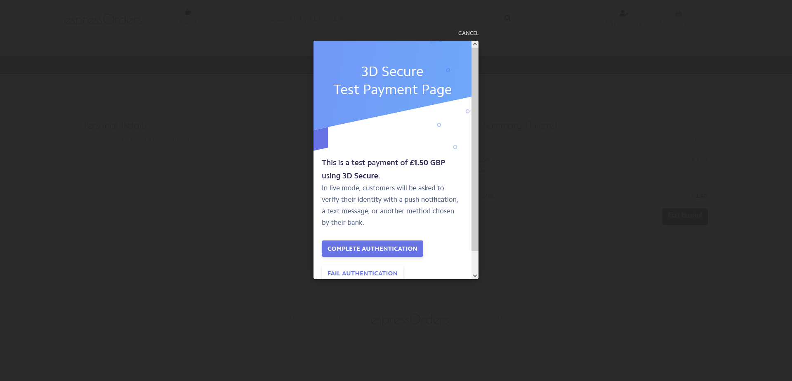

# **espressOrders Website Testing** 

The testing, which follows, has been completed on the initial version of the espressOrders Website.

All testing was conducted on the site deployed from Heroku (https://ab79-espressorders-dev.herokuapp.com/)

---

## **Contents**
1. **[Functional Testing](#Functional-testing)**
    - [Search](#Search)
    - [Types Filtering](#Types-filtering)
    - [Categories Filtering](#Category-filtering)
    - [Registration](#Register)
    - [Login](#Login)
    - [Logout](#Logout)
    - [Profile](#Profile)
    - [Products/Basket/Checkout](#Products/Basket/Checkout)
    - [Add Product](#Add-product)
    - [Edit Product](#Edit-product)
    - [Delete Product](#Delete-product)
 
2. **[User Story testing](#User-story-testing)**

3. **[Responsiveness Testing](#Responsiveness-testing)**
    - [Mobile](#Mobile)
    - [Tablet](#Tablet)

4. **[Browser Testing](#Browser-testing)**

5. **[Bugs](#Bugs)**

6. **[Validation](#Validation)**

---

# **Functional Testing**
The functionality of each webpage/process was tested from the Heroku deployed site (version 52) - any issues were noted: 

## Search

The search functionality was tested to ensure that a items will be returned when the searched word is in the title or description:

- User gets error when trying to search with no criteria entered - as expected

- User search for 'Latte' which returns results from item title for (Latte, Iced Latte & Chai Latte) and from item description (Flat White) which states 'A flat white is similar to our latte,' - as expected

### These tests proves the search functionality works as expected

---

## Types filtering

The filtering by type functionality was tested to ensure that only items each type (Hot Drinks / Cold Drinks / Iced Drinks) displayed whenever that type was selected:

- User selects Hot Drinks from either All Hot Drinks option in Nav or Hot Drinks in footer - filters as expected

- User selects Cold Drinks from either All Cold Drinks option in Nav or Cold Drinks in footer - filters as expected

- User selects Iced Drinks from either All Iced Drinks option in Nav or Iced Drinks in footer - filters as expected

### These tests proves the type filtering functionality works as expected

---

## Categories filtering

The filtering by categories functionality was tested to ensure that only items each category (Coffee / Tea / Speciality Coffee) displayed whenever that category was selected (screenshot only included as evidence of first test):

- User selects Coffee from Hot Drinks option - filters as expected

- User selects Tea from Hot Drinks option - filters as expected

- User selects Speciality Coffee from Hot Drinks option - filters as expected

- User selects Smoothies from Cold Drinks option - filters as expected

- User selects Shakes from Cold Drinks option - filters as expected

- User selects Soft Drinks from Cold Drinks option - filters as expected

- User selects Iced Coffee from Iced Drinks option - filters as expected

### These tests proves the categories filtering functionality works as expected

---

## Registration

User should have be provide all the necessary information in the required format (i.e. password length requirement) to register successfully. Any errors should be highlighted to the user

- User doesn't submit an email address - warns user 'Please fill in this field' against email address field as expected

- User doesn't submit a confirmatory email address - warns user 'Please fill in this field' against email address confirmation field as expected

- User email addresses dont match - generates a '500' server error. Retested following changes to settings.py on version 53. On retest indicates that user 'Must type same email each time'

- User doesn't specify a username - warns user 'Please fill in this field' against the username field as expected

- User doesn't specify a password - warns user 'Please fill in this field' against the password field as expected

- User doesn't specify same password both times - warns user 'You must use the same password each time' against the password field as expected

- All details supplied - user gets redirected to verify there email address and an email is sent to their supplied email address

- After copy/paste of link user is directed to confirm email address - as expected

- They get a success message and are prompted to log in

- User account has been created & can be seen in admin. Email address is registered and verified.

### These tests proves registration works as expected

---

## Login

Users should not be able to log in without completing the required username/password information

- User doesn't supply any information; they are asked to complete the username field as expected

- User doesn't supply a username but completes password field; they are asked to complete the username field as expected

- User doesn't supply a password but completes username field; they are asked to complete the password field as expected

- User supplying all correct information login successfully as expected

### These tests proves login works as expected

---

## Logout

User should be able to logout using the relevant link

- User selects logout from My Account and clicks the Sign Out to sign out of their profile as expected

### These tests proves logout works as expected

---

## Profile

Registered users who logged in should be able to access their profile under the My Profile dropdown 

- User selects my profile and acces their profile as expected

- Users inputting default name/email address/phone number and clicking update information updates/saves those details as expected

### These tests proves profile works as expected

---

## Products/Basket/Checkout

User should be able to view products related to a specific cart and see details about each product

- User can select a button from the Home Page to access the products as expected

- User can click on the product to get more information as expected

- User can select a drink size from dropdown menu as expected

- User can increase/decrease quantity of products to order as expected

- User can click the order button to add the product/size/quantity combination to the order/basket as expected

- User can click button to return to all products view as expected

- User can click on the Go To Checkout button on the toast/message to go directly to the checkout as expected

- User can click the edit basket button to return to the basket directly from the checkout as expected

- User can cancel product by clicking x beside the item in the basket as expected

- User can access the checkout by clicking the Checkout button as expected

- User is redirected to the registration page directly from checkout when they select the 'Create an account' link - as expected

- User is redirected to the login page directly from the checkoit when they select the 'login' link - as expected

- User doesn't supply a full name - get a warning 'Please fill in this field' against the name field - as expected

- User doesn't supply an email address - get a warning 'Please fill in this field' against the email field - as expected

- User doesn't supply a phone number - get a warning 'Please fill in this field' against the phone field - as expected

- User doesn't select a location - get a warning 'Please select an item in this field' against the location field - as expected

- User doesn't enter full card details - get a warning indicating Card details are incomplete against the Stripe payment field - as expected

- User enters valid card details - gets redirected to the checkout successful page - as expected

- User enters card details which require validation - gets held for validation and then redirected to checkout successful or back to checkout page - as expected

- User enters invalid card details - gets returned to checkout page with relevant error displayed - as expected. Stripe dashboard indicates card payment failed.

- User closes window during checkout process before checkout success. Order for 5x Sparkling Waters (£10) was paid for but not confirmed/order successfully completed. Checking within the admin orders table the order is there - as expected. Checking on Stripe admin shows that the payment was taken successfully. Bug noted that the Basket doesn't clear successfully even though the order/payment has been taken.

### These tests proves products/basket/checkout works as expected

---

## Add Product

Admin Users can add products:

- Non Admin user (hotley) should not have access to Product Management option under My Profile - as expected

- Admin user (ab5779) has access to Product Management - as expected

- Admin User can successfully add new Tea product - as expected

- Non admin user cannot enter naviagte directly to 'https://ab79-espressorders-dev.herokuapp.com/products/add/' - they are redirected to home page or login page as expected

### These tests proves adding products works as expected

---

## Edit Product

Admin Users can edit products:

- Non Admin user (hotley) should not have access to Edit | Delete option under product/product detail view - as expected

- Admin user (ab5779) has access to Edit | Delete option - as expected

- Admin User can successfully edit new Tea product - as expected

- Non admin user cannot enter naviagte directly to 'https://ab79-espressorders-dev.herokuapp.com/products/edit/21' - they are redirected to home page or login page as expected

### These tests proves editing products works as expected

---

## Delete Product

Admin User can delete products:

- Admin user deletes Test Tea product:

- Non admin user cannot enter naviagte directly to 'https://ab79-espressorders-dev.herokuapp.com/products/delete/21' - they are redirected to home page or login page as expected

### These tests proves deleting products works as expected

---

# **User story testing**

The user stories from the README.md file were used as a basis for testing.  For each test case the test acceptance criteria, evidence/observations and outcome have been recorded:

**1. "As a customer I expect to be able to find information about where the coffee carts are located"**

Acceptance criteria:
- End users should be able to find information of the carts locations  

Evidence/Observations:
- The about_us.html page contains information on espressoOrders and the carts. Location forms part of this information 

Outcome: Test successful

---

**2. "As a customer I expect to be able to find out the opening hours of the carts"**

Acceptance criteria:
- End users should be able to find information about carts opening hours 

Evidence/Observations:
- The about_us.html page contains opening hours for each cart

Outcome: Test successful

---

**3. "As a customer I expect to be able to see what product is available at each cart location"**

Acceptance criteria:
- End users should be able to see the products available for each cart 

Evidence/Observations:
- If user selects a cart to order from on the homepage they get a list of available products to order

Outcome: Test successful

---

**4. As a customer I expect to be able to search for items directly"**

Acceptance criteria:
- End users should be able to search the espressOrders site 

Evidence/Observations:
- Search functionality is accessible on all screens

Outcome: Test successful

---

**5. "As a customer I expect to be able to filter/sort products by their type"**

Acceptance criteria:
- Users should be able to filter/sort products by their type 

Evidence/Observations:
- Users can filter by type/category

Outcome: Test successful

---

**6. "As a customer I expect to be able to find information about each item"**

Acceptance criteria:
- Each product should have information provided about it

Evidence/Observations:
- Each product has a product_detail.html page

Outcome: Test successful

---

**7. "As a customer I expect to be able to customise my order"**

Acceptance criteria:
- User should be able to alter/customise their order

Evidence/Observations:
- Users can alter the quantity and size of each product

Outcome: Test successful

---

**8. "As a customer I expect to be able to clearly see the costs of the items and total order before payment"**

Acceptance criteria:
- User should be able to see the cost of each item and total order cost

Evidence/Observations:
- The individual item and total order cost is displayed clearly in the basket which user can access at any stage

Outcome: Test successful

---

**9. "As a customer I expect to be able to pay for my order through the website"**

Acceptance criteria:
- User should be able to pay for their items through the website

Evidence/Observations:
- Card payments can be taken through Stripe on the website from the checkout page

Outcome: Test successful

---

**10. "As a customer I expect to be able to save my details to speed up my purchasing experience; I also expect to be able to check out with saving my details"**

Acceptance criteria:
- User should be able to save their details

Evidence/Observations:
- Registered users have the ability to save their default details to their profile for future use at checkout

Outcome: Test successful

---

**11. "As a customer I expect to be able to update my details if they have changed since last purchase"**

Acceptance criteria:
- User should be able to update their details

Evidence/Observations:
- Registered users have the ability to update their default details to their profile for future use at checkout

Outcome: Test successful

---

**12. "As a customer I expect to be able to review my past orders"**

Acceptance criteria:
- User should be able to review their past order details

Evidence/Observations:
- Registered users have the ability to review their previous orders from the profile section

Outcome: Test successful

---

**13. "As a customer I expect to be able to keep my personal information secure"**

Acceptance criteria:
- Only users should have access the personal information

Evidence/Observations:
- Each account is secured using AllAuth templates and each user must register and confirm by email their account. Users are required to login each time to access their account.

Outcome: Test successful

---

**14. "As a business owner I expect to be able to add, edit and remove items from the product range"**

Acceptance criteria:
- Admin user should be able to add/delete items and amend product details as necessary

Evidence/Observations:
- Admin accounts have access to Product Management function to add products and edit/delete buttons to amend or delete items as required

Outcome: Test successful

---

**15. "As a business owner I expect to be able to record/store/access all information necessary to take payments for customer orders"**

Acceptance criteria:
- Administrators would ability to look back on problem orders

Evidence/Observations:
- Admin users can access the orders tables with all the customer information related to an order - it is expected such users would have access to the Stripe dashboard which contains full payment information

Outcome: Test successful

---

**16. "As a business owner I expect to be able to have a means to quickly differentiate between customer orders to ensure each customer gets their order correctly"**

Acceptance criteria:
- Cart owners need a quick means of checking orders

Evidence/Observations:
- A QR code is generated with each order which could be scanned by the cart vendor at the point of collection

Outcome: Test successful

---

**17. "As a business owner I expect to be able to be sure that an order is recorded if a user has successfully paid for it (redundancy built in to system)"**

Acceptance criteria:
- Orders must be placed in database if payment is successful no matter what user does

Evidence/Observations:
- A mechanism (webhook handler.py) has been included to ensure that orders are added to database if payment is successful no matter whether user waits for order confirmation/success page etc

Outcome: Test successful

---

**18. "As a business owner I expect to be able to secure the site so only authorised user can access/edit products"**

Acceptance criteria:
- Only admin accounts can access/edit products

Evidence/Observations:
- Security features have been included within the code to ensure that no matter how the user tries to access add/edit/delete products pages they will only be successful if they are a registered admin user

Outcome: Test successful

---

**19. "As a business owner I expect to be able to allow users to access relevant socail media channels"**

Acceptance criteria:
- Site will give access to the owners social media channels

Evidence/Observations:
- Icons located within the footer section allow access to social media

Outcome: Test successful

---

# **Responsiveness Testing**

The website has been designed to be responsive to different screen sizes. The following has been checked on both mobile (iPhone SE/safari) and tablet (ipad/safari browser) sized devices.

## Mobile

- The items on the products pages display singly as expected
- Image elements on home page disappear as expected
- Hamburger menu is deployed

## Tablet 

- The cards on the recipes pages display in three as expected 
- Hamburger may be deployed (depends on size/orientation of tablet)

---

# **Browser testing**
The website has been tested on the following browsers:
- Firefox browser (Version 92.0.1 (64-bit))
- Microsoft Edge browser (Version 94.0.992.31 (Official build) (64-bit))
- Safari Browser

---

# **Bugs**
The following major bugs were noted during development of the espressOrder website:
- Once deployed to Heroku migrations which happened locally to sqlite db did not move over to postgresql db. Solution: variables not set correctly within GitPod.
- Media files did not transfer to AWS bucket as expected whenever static files did. Solution: manual upload of images to AWS bucket
- Variety of errors caused by use of most recent version of psycogp2. Solution: reverted to older version of pscyogp2 as used in Boutique Ado
- Issues getting location data stored in the Stripe metadata. Solution: amended code as location was a foreign key and this wasn't accounted for within code
- Issues with images being displayed correctly. Solution: media processor code was incorrect

The following ongoing bugs still remain:
- Emailing order confirmations is not working as expected currently and will need further development work to resolve ASAP

---

# **Validation**

All HTML/CSS/Python pages have been checked against the linters running in GitPod and no significant problems or errors exist with the exception of the following:

- In settings.py the AUTH_PASSWORD_VALIDATORS are showing as too long for PEP8 compliance; however splitting them causes password authentication/registration to fail and 