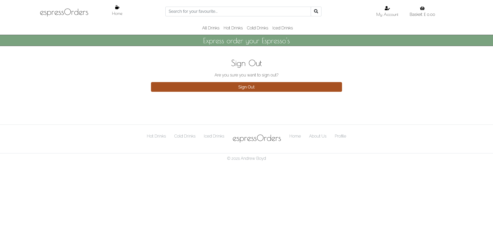

# **espressOrders Website Testing** 

The testing, which follows, has been completed on the initial version of the espressOrders Website.

All testing was conducted on the site deployed from Heroku (https://ab79-espressorders-dev.herokuapp.com/)

---

## **Contents**
1. **[Functional Testing](#Functional-testing)**
    - [Search](#Search)
    - [Types Filtering](#Types-filtering)
    - [Categories Filtering](#Category-filtering)
    - [Registration](#Register)
    - [Login](#Login)
    - [Logout](#Logout)
    - [Profile](#Profile)
    - [Products/Basket/Checkout](#Products/Basket/Checkout)
    - [Add Product](#Add-product)
    - [Edit Product](#Edit-product)
    - [Delete Product](#Delete-product)
 
2. **[User Story testing](#User-story-testing)**

3. **[Responsiveness Testing](#Responsiveness-testing)**
    - [Mobile](#Mobile)
    - [Tablet](#Tablet)

4. **[Browser Testing](#Browser-testing)**

5. **[Bugs](#Bugs)**

6. **[Validation](#Validation)**

---

# **Functional Testing**
The functionality of each webpage/process was tested from the Heroku deployed site (version 52) - any issues were noted: 

## Search

The search functionality was tested to ensure that a items will be returned when the searched word is in the title or description:

- User gets error when trying to search with no criteria entered - as expected

- User search for 'Latte' which returns results from item title for (Latte, Iced Latte & Chai Latte) and from item description (Flat White) which states 'A flat white is similar to our latte,' - as expected

### These tests proves the search functionality works as expected

---

## Types filtering

The filtering by type functionality was tested to ensure that only items each type (Hot Drinks / Cold Drinks / Iced Drinks) displayed whenever that type was selected:

- User selects Hot Drinks from either All Hot Drinks option in Nav or Hot Drinks in footer - filters as expected

- User selects Cold Drinks from either All Cold Drinks option in Nav or Cold Drinks in footer - filters as expected

- User selects Iced Drinks from either All Iced Drinks option in Nav or Iced Drinks in footer - filters as expected

### These tests proves the type filtering functionality works as expected

---

## Categories filtering

The filtering by categories functionality was tested to ensure that only items each category (Coffee / Tea / Speciality Coffee) displayed whenever that category was selected (screenshot only included as evidence of first test):

- User selects Coffee from Hot Drinks option - filters as expected

- User selects Tea from Hot Drinks option - filters as expected

- User selects Speciality Coffee from Hot Drinks option - filters as expected

- User selects Smoothies from Cold Drinks option - filters as expected

- User selects Shakes from Cold Drinks option - filters as expected

- User selects Soft Drinks from Cold Drinks option - filters as expected

- User selects Soft Drinks from Cold Drinks option - filters as expected

- User selects Iced Coffee from Iced Drinks option - filters as expected

### These tests proves the categories filtering functionality works as expected

---

## Registration

User should have be provide all the necessary information in the required format (i.e. password length requirement) to register successfully. Any errors should be highlighted to the user

- User doesn't submit an email address - warns user 'Please fill in this field' against email address field as expected

- User doesn't submit a confirmatory email address - warns user 'Please fill in this field' against email address confirmation field as expected

- User email addresses dont match - generates a '500' server error. Retested following changes to settings.py on version 53. On retest indicates that user 'Must type same email each time'

- User doesn't specify a username - warns user 'Please fill in this field' against the username field as expected

- User doesn't specify a password - warns user 'Please fill in this field' against the password field as expected

- User doesn't specify same password both times - warns user 'You must use the same password each time' against the password field as expected

- All details supplied - user gets redirected to verify there email address and an email is sent to their supplied email address

- After copy/paste of link user is directed to confirm email address - as expected

- They get a success message and are prompted to log in

- User account has been created & can be seen in admin. Email address is registered and verified.

### These tests proves registration works as expected

---

## Login

Users should not be able to log in without completing the required username/password information

- User doesn't supply any information; they are asked to complete the username field as expected

- User doesn't supply a username but completes password field; they are asked to complete the username field as expected

- User doesn't supply a password but completes username field; they are asked to complete the password field as expected

- User supplying all correct information login successfully as expected

### These tests proves login works as expected

---

## Logout

User should be able to logout using the relevant link

- User selects logout from My Account and clicks the Sign Out to sign out of their profile as expected

### These tests proves logout works as expected

---

## Profile

Registered users who logged in should be able to access their profile under the My Profile dropdown 

- User selects my profile and acces their profile as expected

- Users inputting default name/email address/phone number and clicking update information updates/saves those details as expected

### These tests proves profile works as expected

---

## Products/Basket/Checkout

User should be able to view products related to a specific cart and see details about each product

- User can select a button from the Home Page to access the products as expected

- User can click on the product to get more information as expected

- User can select a drink size from dropdown menu as expected

- User can increase/decrease quantity of products to order as expected

- User can click the order button to add the product/size/quantity combination to the order/basket as expected

- User can click button to return to all products view as expected

- User can click on the Go To Checkout button on the toast/message to go directly to the checkout as expected

- User can click the edit basket button to return to the basket directly from the checkout as expected

- User can cancel product by clicking x beside the item in the basket as expected

- User can access the checkout by clicking the Checkout button as expected

- User is redirected to the registration page directly from checkout when they select the 'Create an account' link - as expected

- User is redirected to the login page directly from the checkoit when they select the 'login' link - as expected

- User doesn't supply a full name - get a warning 'Please fill in this field' against the name field - as expected

- User doesn't supply an email address - get a warning 'Please fill in this field' against the email field - as expected

- User doesn't supply a phone number - get a warning 'Please fill in this field' against the phone field - as expected

- User doesn't select a location - get a warning 'Please select an item in this field' against the location field - as expected

- User doesn't enter full card details - get a warning indicating Card details are incomplete against the Stripe payment field - as expected

- User enters valid card details - gets redirected to the checkout successful page - as expected

- User enters card details which require validation - gets held for validation and then redirected to checkout successful or back to checkout page - as expected

- User enters invalid card details - gets returned to checkout page with relevant error displayed - as expected. Stripe dashboard indicates card payment failed.

- User closes window during checkout process before checkout success. Order for 5x Sparkling Waters (£10) was paid for but not confirmed/order successfully completed. Checking within the admin orders table the order is there - as expected. Checking on Stripe admin shows that the payment was taken successfully. Bug noted that the Basket doesn't clear successfully even though the order/payment has been taken.

### These tests proves products/basket/checkout works as expected

---

## Add Product

Admin Users can add products:

- Non Admin user (hotley) should not have access to Product Management option under My Profile - as expected

- Admin user (ab5779) has access to Product Management - as expected

- Admin User can successfully add new Tea product - as expected

- Non admin user cannot enter naviagte directly to 'https://ab79-espressorders-dev.herokuapp.com/products/add/' - they are redirected to home page or login page as expected

### These tests proves adding products works as expected

---

## Edit Product

Admin Users can edit products:

- Non Admin user (hotley) should not have access to Edit | Delete option under product/product detail view - as expected

- Admin user (ab5779) has access to Edit | Delete option - as expected

- Admin User can successfully edit new Tea product - as expected

- Non admin user cannot enter naviagte directly to 'https://ab79-espressorders-dev.herokuapp.com/products/edit/21' - they are redirected to home page or login page as expected

### These tests proves editing products works as expected

---

## Delete Product

Admin User can delete products:

- Admin user deletes Test Tea product:

- Non admin user cannot enter naviagte directly to 'https://ab79-espressorders-dev.herokuapp.com/products/delete/21' - they are redirected to home page or login page as expected

### These tests proves deleting products works as expected

---

# **User story testing**

The user stories from the README.md file were used as a basis for testing.  For each test case the test acceptance criteria, evidence/observations and outcome have been recorded:

**1. "As a user I want to find campfire recipes so that I can cook meals on an open fire"**

Acceptance criteria:
- End users should be able to find campfire recipes  
- This information should be available on all device sizes.

Evidence/Observations:
- The recipes.html page contains recipes suitable for cooking on an open fire 

Outcome: Test successful

---

**2. "2. As a user I want to be able to add my own recipes so that others can enjoy them"**

Acceptance criteria:
- End users should be able to upload a recipe 
- This information should be available on all device sizes.

Evidence/Observations:
- Users can upload recipes through the add recipes function

Outcome: Test successful

---

**3. "As a user I want to be able to edit my recipes so that I can update/amend details after I've submitted them"**

Acceptance criteria:
- End users should be able to edit their recipes after submission 
- This information should be available on all device sizes.

Evidence/Observations:
- Users can edit their recipes through the edit recipes function

Outcome: Test successful

---

**4. "4. As a user I want to be able to delete my recipes so that I'm in control of my recipe"**

Acceptance criteria:
- End users should be able to deleted their recipes 
- This alternative means should be available on all device sizes.

Evidence/Observations:
- Users can delete their recipes from the recipes page

Outcome: Test successful

---

**5. "5. As a user I want to find out best practices for campfire cooking so that I can improve my cookery"**

Acceptance criteria:
- The website, should give users information on how they should cook the recipes 
- This information should be available on all device sizes.

Evidence/Observations:
- The website gives method steps for each recipe

Outcome: Test successful

---

**6. "6. As a user I want to be able to search for recipes so I can quickly find the information I'm looking for"**

Acceptance criteria:
- The website has search functionality
- This information should be available on all device sizes.

Evidence/Observations:
- The website gives method steps for each recipe

Outcome: Test successful

---

**7. "7. As a business owner I want to be able to generate increased brand awareness so that my brand becomes synonymous with open fire cooking"**

Acceptance criteria:
- The branding of the company should be clear throughout the website
- This information should be available on all device sizes.

Evidence/Observations:
- The website has the Campfire cooking branding, colours and logo throughout

Outcome: Test successful

---

**8. "8. As a site administrator I want to be able to maintain the user recipe section so I can maintain the quality of the recipes submitted"**

Acceptance criteria:
- The administratorshould be able to edit and remove recipes if required
- This information should be available on all device sizes.

Evidence/Observations:
- When using the administrator account all recipes can be edited and/or deleted

Outcome: Test successful

---

# **Responsiveness Testing**

The website has been designed to be responsive to different screen sizes. The following has been checked on both mobile (iPhone SE/safari) and tablet (ipad/safari browser) sized devices.

## Mobile

- The cards on the recipes pages display singly as expected
- Image elements on view recipe disappear as expected
- Sidenav is deployed

## Tablet 

- The cards on the recipes pages display in two or three as expected (depends on size of tablet)
- Sidenav may be deployed (depends on size/orientation of tablet)

---

# **Browser testing**
The website has been tested on the following browsers:
- Firefox browser (Version 86.0 (64-bit))
- Microsoft Edge browser (Version 89.0.774.54 (Official build) (64-bit))
- Chrome Browser (Version 89.0.4389.90 (Official Build) (64-bit))
- Safari Browser

---

# **Bugs**
The following bugs were noted during development of the Campfire Cooking website:
- Delete functionality worked correctly prior to using a modal to confirm the deletion. Once the modal was coded recipes were deleted but it was not the selected recipe but the first recipe from that user. Solution: as the generation of the modal was part of the for loop the modal needed to be created with a unique id to allow deletion of correct recipe.
- Social media icons were not available on Materialize. Solution: found some custom code which used Font Awesome icons but styled them in similar fashion to the Materialize site
- Viewing recipes on mobile site made the 4x1 grid to become unreadable. Solution: set media query to operate at lower screen sizes which amends grid to 2x2 and assigned elements to specific positions on the grid to ensure labels and values sit correctly

---

# **Validation**

All HTML/CSS/Python pages have been checked against the linters running in GitPod and no problems or errors exist.